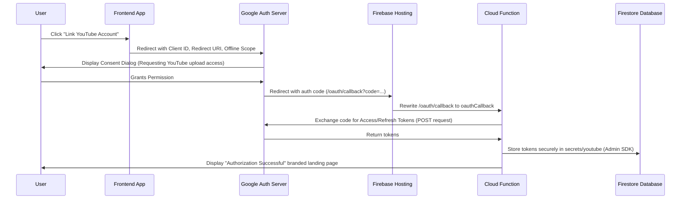

# YouTube OAuth Integration Guide

This guide documents the implementation of the secure Google OAuth 2.0 flow for linking YouTube channels to the Content Calendar app for automated video posting.

---

## 1. Flow Architecture

Below is the step-by-step token acquisition and storage flow:



---

## 2. Component Implementation Details

### A. Database Security (`firestore.rules`)
To prevent unauthorized reads or writes of sensitive refresh tokens from client-side code, the `secrets` collection is strictly locked down:
```javascript
match /secrets/{document} {
  allow read, write: if false;
}
```
*Note: The Cloud Function runs on the server side using the Firebase Admin SDK, which bypasses security rules, allowing it to write the tokens securely.*

### B. Backend Cloud Function (`functions/index.js`)
- **Endpoint**: `/oauth/callback` (mapped via Firebase Hosting rewrites).
- **Core Functionality**: Uses Google's official `googleapis` library to instantiate an OAuth2 client, exchange the temporary authentication `code` for long-lived tokens, and store the token details in Firestore under `secrets/youtube`.
- **Environment Variables**: Managed server-side in `functions/.env` (gitignored to prevent leaks):
  ```env
  GOOGLE_CLIENT_ID=YOUR_GOOGLE_CLIENT_ID
  GOOGLE_CLIENT_SECRET=YOUR_GOOGLE_CLIENT_SECRET
  ```

### C. Frontend Integration (`src/pages/Settings.jsx`)
- Displays the **YouTube Channel Connection** card.
- Shows current connection status based on whether a document exists in the `secrets/youtube` path in Firestore.
- Generates the authorization invite link dynamically and provides a **Copy Link** feature.

---

## 3. How to Connect a YouTube Channel

To link a channel, the channel owner must complete a one-time Google consent step:

1. Send the channel owner the following link (or have them click **"Link YouTube Account"** from the Settings page):
   > [Authorize YouTube Connection](https://accounts.google.com/o/oauth2/v2/auth?client_id=YOUR_GOOGLE_CLIENT_ID&redirect_uri=https%3A%2F%2Fcontent-calendar-1adf3.web.app%2Foauth%2Fcallback&scope=https%3A%2F%2Fwww.googleapis.com%2Fauth%2Fyoutube.upload&response_type=code&access_type=offline&prompt=consent)
2. The owner signs in to their Google account and clicks **Allow** to grant permissions.
3. They will be redirected to the success landing page.
4. The dashboard connection card will instantly switch to **"Connected"**.

---

## 4. Troubleshooting & Maintenance

### Cloud Build Permissions
If you redeploy Cloud Functions and get a build error, ensure the **Compute Engine default service account** (`992597471788-compute@developer.gserviceaccount.com`) has the following IAM roles enabled in Google Cloud Console:
- **Artifact Registry Writer**
- **Storage Object Viewer**
- **Logs Writer**
